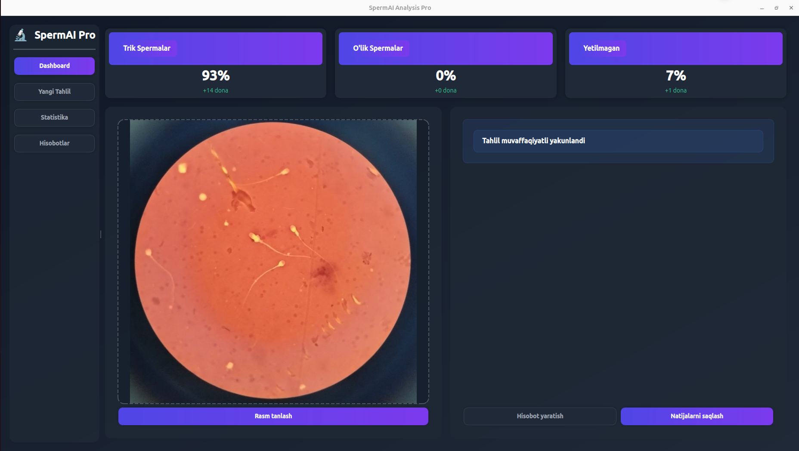
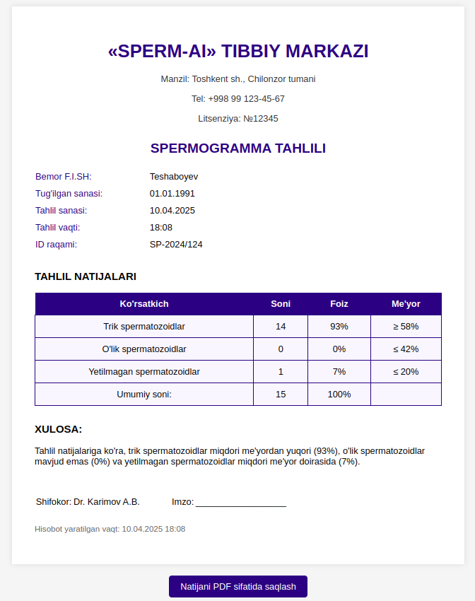

# SpermAI Pro

**SpermAI Pro** is a real-time, AI-powered desktop application designed to automate sperm analysis using computer vision and deep learning. Built with PyQt6, OpenCV, and YOLOv8, it features an intuitive and responsive UI tailored for medical laboratory environments.

---

## 🧬 Features

- **Real-time sperm detection and classification** (live, dead, immature)
- **Powered by YOLOv8** for high-performance object detection
- **Modern desktop UI** with PyQt6
- **Statistical visualization** of results with percentage and count
- **Detailed report generation** (HTML & TXT)
- **CSV-style result saving**
- **Dark mode and responsive layout**

---

## 📸 Sample UI Preview

> The app highlights each detected sperm on the image and provides a full analysis summary.

 <!-- Replace with actual screenshot if available -->

---

## 🧠 Technologies Used

| Component         | Technology        |
|------------------|-------------------|
| Detection Model   | YOLOv8 (Ultralytics) |
| GUI Framework     | PyQt6             |
| Image Processing  | OpenCV            |
| Data Handling     | NumPy, Python I/O |
| Report Generation | HTML, TXT         |

---

## 🚀 How It Works

1. **Upload** a microscope image
2. **Run Detection** using the YOLOv8 model
3. **View Live Stats**:
   - Total sperms
   - Percentage of live, dead, and immature
4. **Save Reports**:
   - Save image + result to file
   - Export PDF/HTML or plain text reports

---

## 📂 Project Structure

```
sperm-ai-pro/
├── main.py                   # Main app launcher
├── icons/                   # Icon assets
├── reports/                 # Saved reports (auto-created)
├── results/                 # Saved analysis results
├── index.html               # HTML template for reports
├── best(1).pt               # Trained YOLOv8 model
```

---

## 📥 Installation

> **Requirements:** Python 3.8+, PyQt6, OpenCV, Ultralytics YOLOv8, NumPy

```bash
# Clone the repository
git clone https://github.com/yourusername/sperm-ai-pro.git
cd sperm-ai-pro

# (Optional) Create a virtual environment
python -m venv venv
source venv/bin/activate  # Or venv\Scripts\activate on Windows

# Install dependencies
pip install -r requirements.txt
```

---

## ▶️ Running the Application

```bash
python main.py
```

> Make sure the model file `best(1).pt` is available in the root directory.

---

## 🧪 Sample Workflow

1. Launch the app
2. Click on **"Rasm tanlash"** to select an image
3. Wait for the model to detect and classify sperms
4. Click **"Hisobot yaratish"** to fill patient info and generate the report
5. Save the result or share the report

---

## 📄 Sample Output

```txt
=== SPERM TAHLILI NATIJASI ===
Sana: 10.04.2025 18:08
Bemor: Teshaboyev
Tug'ilgan sana: 01.01.1991
ID: SP-2024/124

--- NATIJALAR ---
Trik spermalar: 93%
O'lik spermalar: 0%
Yetilmagan spermalar: 7%

XULOSA:
Spermatogenez normal ko'rinishda
Shifokor: Dr. AI
```

---

## 🌐 Localization
- The app interface and reports are in **Uzbek language**
- Customizable for multilingual support (future release)

---

## 📌 Future Improvements

- Add PDF report generation
- Real-time video detection via webcam
- Multilingual support (EN, RU)
- User login and history tracking

---

## 🙌 Author
**Bahrombek Muhammadiyev**  
📧 [bahrombekmuhammadiyev@gmail.com](mailto:bahrombekmuhammadiyev@gmail.com)  
🔗 [LinkedIn profilim](https://www.linkedin.com/in/muhammadiyevbahrombek/)


---

## 🧠 Inspired by real healthcare problems
> Helping medical labs digitize sperm analysis with AI

---

## 📜 License
This project is open-source and free to use for educational and non-commercial use. For commercial licensing, please contact the author.

---

**#YOLOv8 #PyQt6 #SpermAnalysis #ComputerVision #OpenCV #MedicalAI #Uzbekistan #AIHealth #Python #DesktopApp**


